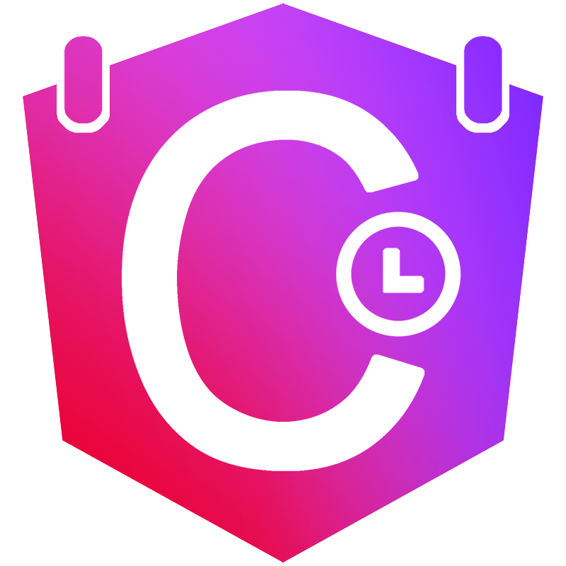

<div align="center">
  
  <h1>🗓️ NGX-Chronica</h1>
  <p><strong>Complete Date & Time Picker Suite for Angular</strong></p>
  
  <p>
    <a href="https://www.npmjs.com/package/ngx-chronica"></a>
    <a href="https://www.npmjs.com/package/ngx-chronica"></a>
    <a href="https://github.com/klajdm/ngx-chronica/blob/main/LICENSE"></a>
    <a href="https://angular.io"></a>
    <a href="https://github.com/klajdm/ngx-chronica/stargazers"></a>
  </p>
  
  <p>
    <a href="https://ngx-chronica.vercel.app"><strong>📚 Documentation</strong></a> •
    <a href="https://ngx-chronica.vercel.app/start"><strong>🚀 Quick Start</strong></a> •
    <a href="#-components"><strong>📦 Components</strong></a> •
    <a href="#-contributing"><strong>🤝 Contributing</strong></a>
  </p>
  
  
</div>

---

## 🌟 Overview

**NGX-Chronica** is a comprehensive Angular library providing **6 specialized date and time picker components** that fill critical gaps in the Angular ecosystem. Built with modern Angular practices, full TypeScript support, and zero external dependencies.

### 🎯 Why NGX-Chronica?

The Angular ecosystem lacks robust, production-ready **Date &Time Picker** components. NGX-Chronica addresses these gaps with components that are:

- ✅ **Battle-Tested** - Used in production applications
- ✅ **Zero Dependencies** - No Moment.js, date-fns, or other heavy libraries
- ✅ **Fully Typed** - Complete TypeScript definitions
- ✅ **Accessible** - WCAG 2.1 AA compliant
- ✅ **Themeable** - 8 color themes + dark mode
- ✅ **i18n Ready** - 11 built-in locales + custom locale support

## 📦 Components

| Component          | Description                      | Key Features                                  |
| ------------------ | -------------------------------- | --------------------------------------------- |
| **DatePicker**     | Single date selection with popup | Min/max dates, disabled dates, locale support |
| **DateRange**      | Start/end date selection         | Hover preview, quick presets, validation      |
| **InlineCalendar** | Always-visible calendar          | Embedded display, no popup overhead           |
| **TimePicker**     | Time selection (12h/24h)         | Step intervals, min/max time, seconds support |
| **DateTimePicker** | Combined date + time             | Unified interface, flexible layout            |
| **DurationPicker** | Time span selection              | Days/hours/minutes/seconds, preset durations  |

## ✨ Key Features

- 🗓️ **6 Specialized Components** - Complete toolkit for all date/time needs
- 🎨 **8 Color Themes** - Blue, Green, Purple, Red, Orange, Teal, Pink, Indigo
- 🌍 **11 Built-in Locales** - EN, ES, FR, DE, IT, PT, ZH, JA, KO, RU + custom
- 📱 **Responsive** - Mobile-friendly with touch support
- 🚫 **Smart Validation** - Min/max constraints, disabled dates/times
- 📝 **Form Integration** - Full `ControlValueAccessor` support
- ⚡ **Standalone Components** - Works with standalone or NgModule apps
- ♿ **Accessible** - Keyboard navigation, ARIA labels, screen readers
- 🎯 **TypeScript First** - Comprehensive type definitions
- 🎨 **Customizable** - CSS custom properties for theming

## 📥 Installation

```bash
npm install ngx-chronica
```

## 🚀 Quick Start

```typescript
import { Component } from '@angular/core';
import { ChronicaDatepickerComponent } from 'ngx-chronica';

@Component({
  selector: 'app-example',
  standalone: true,
  imports: [ChronicaDatepickerComponent],
  template: `
    <chronica-datepicker
      [(ngModel)]="selectedDate"
      [config]="{ colorTheme: 'blue', theme: 'light' }"
      (dateSelected)="onDateSelected($event)"
    />
  `,
})
export class ExampleComponent {
  selectedDate: Date | null = new Date();

  onDateSelected(date: Date) {
    console.log('Selected:', date);
  }
}
```

**📚 [View Full Documentation](https://ngx-chronica.vercel.app)**

## 🏗️ Project Structure

This is a monorepo containing:

```
ngx-chronica/
├── projects/chronica/          # 📦 Library source code
│   ├── src/lib/
│   │   ├── components/         # 6 picker components
│   │   ├── models/             # TypeScript interfaces
│   │   ├── utils/              # Utility functions
│   │   └── chronica.module.ts  # Optional NgModule
│   └── public-api.ts           # Public API exports
├── src/                        # 🌐 Documentation website
│   ├── app/
│   │   ├── components/         # Demo components
│   │   └── features/           # Feature pages
│   └── assets/                 # Static assets
└── docs/                       # 📚 Additional documentation
```

## 🛠️ Development

### Prerequisites

- Node.js 18+ and npm 9+
- Angular CLI 19+

### Setup

```bash
# Clone the repository
git clone https://github.com/klajdm/ngx-chronica.git
cd ngx-chronica

# Install dependencies
npm install

# Start development server (documentation site)
npm start

# Build the library
npm run build:lib

# Run tests
npm test

# Lint code
npm run lint
```

### Adding a New Component

1. Create component in `projects/chronica/src/lib/components/`
2. Implement `ControlValueAccessor` interface
3. Add models to `projects/chronica/src/lib/models/`
4. Export in `public-api.ts`
5. Add to `ChronicaModule`
6. Create demo page in `src/app/features/`
7. Update documentation

### Testing

```bash
# Run unit tests
npm test

# Run tests with coverage
npm run test:coverage

# Run e2e tests
npm run e2e
```

## 🏛️ Architecture

### Design Principles

- **Standalone First** - All components are standalone by default
- **Type Safety** - Comprehensive TypeScript interfaces
- **Zero Dependencies** - No external date libraries
- **Accessibility** - WCAG 2.1 AA compliant
- **Performance** - OnPush change detection, lazy loading
- **Modularity** - Tree-shakeable exports

### Component Pattern

All picker components follow this pattern:

```typescript
@Component({
  standalone: true,
  providers: [
    { provide: NG_VALUE_ACCESSOR, useExisting: forwardRef(() => Component), multi: true },
  ],
  changeDetection: ChangeDetectionStrategy.OnPush,
})
export class ChronicaComponent implements ControlValueAccessor, OnInit, OnDestroy {
  // Angular CDK Overlay for popups
  private overlayRef: OverlayRef | null = null;

  // ControlValueAccessor implementation
  writeValue(value: T): void {}
  registerOnChange(fn: any): void {}
  registerOnTouched(fn: any): void {}
  setDisabledState(isDisabled: boolean): void {}
}
```

## 🤝 Contributing

We welcome contributions! Here's how you can help:

### Ways to Contribute

- 🐛 **Report Bugs** - [Open an issue](https://github.com/klajdm/ngx-chronica/issues)
- 💡 **Suggest Features** - [Start a discussion](https://github.com/klajdm/ngx-chronica/discussions)
- 📝 **Improve Docs** - Fix typos, add examples
- 🔧 **Submit PRs** - Fix bugs, add features
- ⭐ **Star the Repo** - Show your support!

### Contribution Guidelines

1. **Fork the repository**
2. **Create a feature branch** - `git checkout -b feature/amazing-feature`
3. **Follow coding standards** - Run `npm run lint`
4. **Write tests** - Maintain >90% coverage
5. **Update documentation** - Add examples and API docs
6. **Commit with conventional commits** - `feat:`, `fix:`, `docs:`, etc.
7. **Push to your fork** - `git push origin feature/amazing-feature`
8. **Open a Pull Request** - Describe your changes

### Code Style

- Use **TypeScript strict mode**
- Follow **Angular style guide**
- Use **OnPush change detection**
- Implement **ControlValueAccessor** for form components
- Add **ARIA attributes** for accessibility
- Write **comprehensive tests**

### Commit Convention

```
feat(datepicker): add keyboard navigation
fix(time-picker): resolve 12h/24h conversion bug
docs(readme): update installation instructions
test(duration): add validation tests
perf(calendar): optimize date generation
style(components): apply consistent spacing
refactor(utils): extract date utilities
ci(github): add automated testing
```

## 📊 Roadmap

### Current Version (v1.x)

- ✅ DatePicker component
- ✅ DateRange component
- ✅ InlineCalendar component
- ✅ TimePicker component
- ✅ DateTimePicker component
- ✅ DurationPicker component
- ✅ 11 built-in locales
- ✅ 8 color themes
- ✅ Dark mode support

### Planned Features (v2.x)

- 🔄 **Timezone Picker** - Global timezone selection
- 🔄 **Recurring Event Picker** - Schedule repeating events
- 🔄 **Calendar Heatmap** - Data visualization over time
- 🔄 **Month/Year Picker** - Quick month/year selection
- 🔄 **Week Picker** - Select entire weeks
- 🔄 **Quarter Picker** - Business quarter selection
- 🔄 **Age Calculator** - Date difference calculations
- 🔄 **Countdown Timer** - Live countdown displays

### Future Enhancements

- 📱 Enhanced mobile gestures (swipe navigation)
- ⌨️ Advanced keyboard shortcuts
- 🎨 Theme builder tool
- 🌐 More locale support (20+ languages)
- 📦 Smaller bundle size optimizations
- 🧪 Comprehensive E2E test suite

**[Vote on features](https://github.com/klajdm/ngx-chronica/discussions/categories/feature-requests)**

## 📈 Performance

NGX-Chronica is optimized for performance:

- **Tree-shakeable** - Only import what you need
- **OnPush Change Detection** - Minimal re-renders
- **Lazy Loading** - Components load on demand
- **Small Bundle Size** - ~15KB per component (gzipped)
- **No External Dependencies** - Zero runtime dependencies
- **Virtual Scrolling** - Efficient rendering for large lists

### Angular Version Support

| Angular | NGX-Chronica | Status       |
| ------- | ------------ | ------------ |
| 15.x    | 1.x          | ✅ Supported |
| 16.x    | 1.x          | ✅ Supported |
| 17.x    | 1.x          | ✅ Supported |
| 18.x    | 1.x          | ✅ Supported |
| 19.x    | 1.x          | ✅ Supported |

## 📄 License

MIT License - see [LICENSE](./LICENSE) file for details.

## 🔗 Links & Resources

- 📚 **[Documentation](https://ngx-chronica.vercel.app)** - Full API docs and examples
- 🚀 **[Getting Started](https://ngx-chronica.vercel.app/start)** - Quick start guide
- 🐛 **[Issue Tracker](https://github.com/klajdm/ngx-chronica/issues)** - Report bugs
- 💬 **[Discussions](https://github.com/klajdm/ngx-chronica/discussions)** - Ask questions
- 📦 **[npm Package](https://www.npmjs.com/package/ngx-chronica)** - Install via npm
- 🤝 **[Contributing](https://github.com/klajdm/ngx-chronica/blob/main/CONTRIBUTING.md)** - Contribution guide

## ⭐ Show Your Support

If NGX-Chronica helps your project, please consider:

- ⭐ **Star this repository** on GitHub
- 🐦 **Share on Twitter** with #ngxchronica
- 📝 **Write a blog post** about your experience
- 💬 **Recommend to colleagues** who use Angular
- 🤝 **Contribute** code, docs, or ideas

---

<div align="center">
  <p><strong>Made with ❤️ for the Angular community</strong></p>
  <p>
    <a href="https://ngx-chronica.vercel.app">Documentation</a> •
    <a href="https://github.com/klajdm/ngx-chronica">GitHub</a> •
    <a href="https://www.npmjs.com/package/ngx-chronica">npm</a> •
  </p>
</div>
